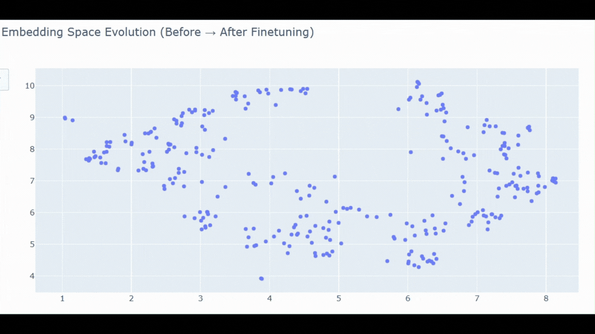
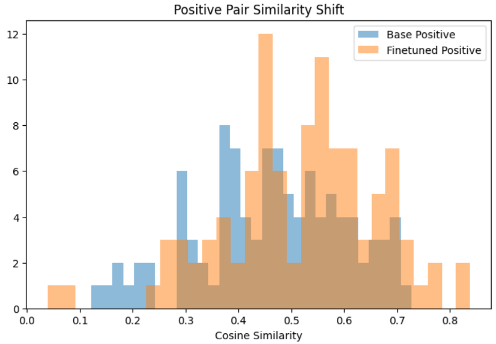

# Embedding Finetuning for Improved Retrieval

This project focuses on improving retrieval quality by finetuning an embedding model on a domain-specific dataset of job descriptions.

The base model used is `all-distilroberta-v1`, which was further trained using `MultipleNegativesRankingLoss` to better separate relevant and irrelevant samples in the embedding space.

The finetuned model is available on Hugging Face:  
https://huggingface.co/rakesh-tirlangi/distilroberta-embedding-job

## Training Approach

The model was finetuned using pairs of semantically related job descriptions. For each positive pair, other samples in the batch act as implicit negatives, enabling efficient contrastive learning without explicit negative mining. This setup encourages the model to maximize similarity for relevant pairs while minimizing it for unrelated ones.

## Key Idea

Retrieval systems depend on how well embeddings represent similarity. If relevant items are not close to the query in embedding space, the system fails before any language model is used.

Finetuning reshapes the embedding space so that:
- Relevant pairs move closer together  
- Irrelevant pairs move further apart  

This improves the quality of retrieved results.

## Results

### Embedding Space Evolution

The visualization above shows how the embedding space changes after finetuning. Each point represents a sample, and the movement reflects how the model reorganizes semantic relationships.

### Positive Pair Similarity Shift

The distribution above compares similarity scores between queries and their corresponding positive samples before and after finetuning.

## Quantitative Improvement

A simple metric used here is the margin between positive and negative similarities.

Base model margin: 0.219  
Finetuned model margin: 0.523  

The increase shows a stronger separation between correct and incorrect matches.

## Conclusion

Improving embeddings has a direct impact on retrieval quality. Finetuning on domain-specific data allows the model to better understand what is relevant, leading to more accurate and reliable results.

This highlights the importance of treating embeddings as a core component of retrieval systems rather than a fixed solution.
